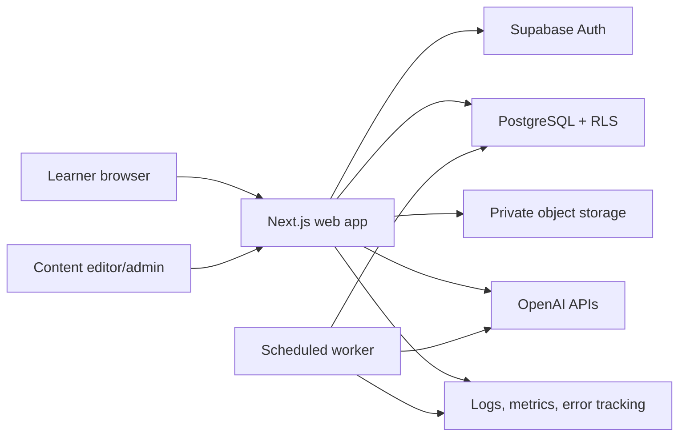
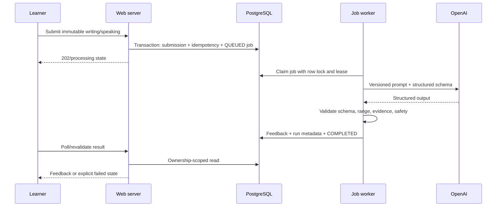

# ARCHITECTURE - Web tự học IELTS

> Phiên bản: 1.0  
> Kiến trúc mục tiêu: modular monolith trên Next.js + Supabase  
> Nguyên tắc: server-first, domain-oriented, không thêm hạ tầng khi chưa có failure mode thực

## 1. Mục tiêu kiến trúc

- Hỗ trợ vòng lặp học tập end-to-end của [PRD.md](./PRD.md).
- Bảo vệ dữ liệu cá nhân bằng authorization ở server và RLS ở database.
- Không mất draft, không double-submit, không tạo duplicate AI job.
- Truy vết được content version, plan version, model/prompt/rubric version.
- Đủ đơn giản cho một developer vận hành nhưng có ranh giới module rõ để mở rộng.
- Tách các tác vụ dài khỏi request đồng bộ bằng DB-backed job queue ở MVP.

## 2. Stack baseline

| Lớp            | Công nghệ                                 | Quyết định                                        |
| -------------- | ----------------------------------------- | ------------------------------------------------- |
| Full-stack     | Next.js App Router + TypeScript strict    | Server Components mặc định; pin major version     |
| UI             | Tailwind CSS + shadcn/ui                  | Token hóa design; component source nằm trong repo |
| Form           | React Hook Form + Zod                     | Client UX + server validation bắt buộc            |
| Auth           | Supabase Auth                             | Session kiểm tra server-side                      |
| Database       | PostgreSQL qua Supabase                   | SQL migrations, constraints, indexes, RLS         |
| Object storage | Supabase Storage                          | Private buckets, signed upload/read URL           |
| Data access    | Supabase server client + typed queries    | Repository cho domain quan trọng                  |
| AI             | OpenAI Responses API + Structured Outputs | Chỉ gọi server; output Zod/JSON Schema            |
| Jobs MVP       | PostgreSQL `ai_jobs` + scheduled worker   | Claim bằng transaction/lock, retry/backoff        |
| Tests          | Vitest, Testing Library, Playwright       | Unit, integration, component, E2E                 |
| Observability  | Structured logs + Sentry/tương đương      | Redact PII/content; trace ID                      |
| Deploy         | Vercel + Supabase hoặc tương đương        | Không nhúng vendor assumptions vào domain         |

Mọi framework/API/model phải được kiểm tra tài liệu chính thức và pin version khi bắt đầu phase liên quan.

## 3. Sơ đồ ngữ cảnh



Browser không truy cập AI hoặc service-role credential trực tiếp. Upload media dùng signed URL ngắn và phải finalize ở server.

## 4. Kiến trúc runtime

### 4.1. Web request path

1. Route/Server Action nhận request.
2. Parse và validate input bằng Zod.
3. Lấy authenticated actor từ server session.
4. Service authorize permission/ownership và kiểm tra state transition.
5. Repository thực hiện typed query/transaction; RLS là lớp phòng thủ bổ sung.
6. Ghi domain event/audit event trong cùng transaction khi cần.
7. Trả typed result; UI render trạng thái thành công/lỗi có trace ID.

### 4.2. AI job path



Job không được đánh dấu `COMPLETED` nếu output chưa qua validation. Retry chỉ áp dụng lỗi retryable; lỗi validation/policy có category rõ.

### 4.3. Autosave path

- Editor giữ local draft được version hóa theo `client_revision`.
- Debounced server autosave dùng optimistic concurrency (`updated_at` hoặc version integer).
- UI hiển thị `local`, `saving`, `saved`, `conflict`, `offline`, `error`.
- Final submit khóa snapshot immutable; autosave sau submit bị từ chối.
- Conflict không silently overwrite; người dùng chọn giữ local/server hoặc tạo revision mới.

## 5. Cấu trúc source đề xuất

```text
src/
  app/
    (public)/
    (auth)/
    onboarding/
    app/
    admin/
    api/
  components/
    ui/
    learning/
    practice/
    ai/
  features/
    goals/
    planning/
    content/
    vocabulary/
    reading/
    listening/
    writing/
    speaking/
    errors/
    analytics/
  server/
    auth/
    services/
    repositories/
    ai/
    jobs/
    storage/
  lib/
    validation/
    errors/
    observability/
    feature-flags/
    idempotency/
  types/
  tests/
supabase/
  migrations/
  seed.sql
docs/
```

### 5.1. Dependency direction

`app/routes -> feature use-cases/services -> repositories/adapters -> Supabase/OpenAI/Storage`

- Route không chứa business logic dài.
- UI không gọi provider AI trực tiếp.
- Repository không quyết định policy nghiệp vụ.
- Domain service không phụ thuộc React/HTTP.
- Shared `lib` chỉ chứa primitive thực sự dùng chung, không trở thành “utils dump”.

## 6. Bounded modules

| Module           | Trách nhiệm                                                 | Không sở hữu                              |
| ---------------- | ----------------------------------------------------------- | ----------------------------------------- |
| Identity         | Profile, settings, consent, roles                           | Auth credentials do Supabase Auth quản lý |
| Goals & Planning | Goal, plan version, weeks, daily task, reschedule           | Nội dung bài học                          |
| Content          | Course/lesson/question/prompt, taxonomy, publish version    | Attempt của learner                       |
| Practice         | Session, answer, scoring deterministic, annotations         | AI scoring                                |
| Vocabulary       | User vocabulary, SRS schedule/review                        | General content lifecycle                 |
| Writing          | Draft, immutable submission, revision                       | Provider call trực tiếp                   |
| Speaking         | Recording metadata, upload finalize, transcript             | Storage policy toàn cục                   |
| AI Feedback      | Job, prompt/rubric version, output validation, run metadata | Mutation goal/content                     |
| Errors           | Error item, review queue, generated drill refs              | Source attempt mutation                   |
| Analytics        | Event definitions, daily aggregates, mastery                | Source-of-truth nghiệp vụ                 |
| Admin/Ops        | RBAC use-cases, audit, flags, operational views             | Bypass domain invariants                  |

## 7. Các invariants quan trọng

### 7.1. Ownership và quyền

- User-owned query luôn scope `user_id = actor.id` hoặc kiểm tra permission cụ thể.
- Không dùng query theo entity ID đơn độc cho owner routes.
- Admin operation phải có permission, không chỉ kiểm tra role string chung chung.
- Service role chỉ dùng ở server/worker và không biến service thành bypass không kiểm soát.

### 7.2. Versioning

- `study_plans`: không ghi đè; plan mới supersede plan cũ.
- `content_versions`: published snapshot immutable.
- `writing_submissions` và `writing_revisions`: immutable sau submit.
- `prompt_versions` và rubric: feedback run tham chiếu chính xác version đã dùng.
- Practice session giữ content version để kết quả cũ reproducible.

### 7.3. Idempotency

Áp dụng cho:

- start/submit practice;
- submit writing;
- finalize speaking upload;
- enqueue/retry AI feedback;
- regenerate/reschedule plan;
- admin publish;
- webhook nếu bổ sung billing sau MVP.

Idempotency key gắn với actor + operation + resource scope; response thành công được replay. Payload khác với cùng key trả conflict.

### 7.4. State transitions

Transition được kiểm tra ở service và DB khi có thể. Không update status tự do từ client. Chi tiết state trong [DATABASE_SCHEMA.md](./DATABASE_SCHEMA.md).

## 8. Data architecture

### 8.1. Source of truth

- PostgreSQL: trạng thái nghiệp vụ, version, result và metadata.
- Object Storage: audio/image binary; DB giữ metadata/path/checksum.
- Browser local storage/IndexedDB: recovery cache, không phải source of truth.
- Analytics aggregate có thể rebuild từ domain events trong retention window.
- AI raw response chỉ phục vụ debug có redaction/retention; validated output mới cấp cho UI.

### 8.2. Transaction boundaries

Một transaction cho các nhóm:

- tạo plan version + weeks + tasks + supersede plan cũ;
- submit practice + lock session + score deterministic + task event;
- submit writing + immutable snapshot + job queue + idempotency record;
- finalize speaking + verify object + submission + transcript job;
- publish content + version snapshot + audit log;
- retry/cancel job + audit.

External AI/storage calls không giữ DB transaction mở. Dùng prepare/finalize hoặc outbox/job pattern.

### 8.3. Consistency

- Strong consistency cho submit, ownership, state và published version.
- Eventual consistency cho AI feedback, analytics aggregate, weekly summary và notification.
- UI phải hiển thị processing/stale state thay vì giả định dữ liệu đã xong.

## 9. API architecture

- Server Actions phù hợp mutation gắn chặt UI và session.
- Route Handlers dùng cho upload, job status, health, integration và endpoint cần HTTP semantics rõ.
- Mọi mutation có input schema, actor context, idempotency và normalized error envelope.
- API không trả service metadata nhạy cảm, raw prompt hay storage path nội bộ.
- Contract chi tiết tại [API_SPEC.md](./API_SPEC.md).

## 10. Authentication và authorization

### 10.1. Authentication

- Supabase Auth quản lý session.
- Server Components/Actions kiểm tra session bằng server client.
- Middleware chỉ redirect/refresh session phục vụ UX, không phải authorization boundary.
- Guest-only redirect chỉ chấp nhận relative path allowlisted để chống open redirect.

### 10.2. Authorization

Ba lớp:

1. Service check ownership/permission.
2. Repository query scope theo actor.
3. PostgreSQL RLS/Storage policy phòng thủ.

Role được map sang permission; `SUPER_ADMIN` không nên được sử dụng cho tác vụ hằng ngày.

## 11. Storage và media

### 11.1. Buckets

- `content-assets`: public hoặc signed tùy licence/publish state.
- `writing-assets`: private nếu chứa tài liệu user.
- `speaking-recordings`: luôn private.

### 11.2. Upload protocol

1. Server authorize và tạo upload intent với mime/size/duration limit.
2. Trả signed upload URL/path scoped theo user và intent.
3. Browser upload trực tiếp.
4. Client gọi finalize với checksum/metadata.
5. Server verify object, owner, type, size; tạo submission/job.
6. Orphan object được cleanup định kỳ.

Signed URL đọc có TTL ngắn. Xóa dữ liệu đi qua domain service và ghi audit/event phù hợp.

## 12. AI architecture

### 12.1. Prompt layers

1. System role và safety constraints.
2. Versioned rubric.
3. Task context.
4. User submission đặt trong delimiter và được coi là data.
5. Structured output contract.
6. Post-validation rules.

### 12.2. Output validation

- JSON Schema/Zod required fields và enum.
- Band nằm 0-9, bước 0.5.
- Evidence là substring/segment hợp lệ của input.
- Giới hạn 3-5 priority issues.
- Audio im lặng/noisy/quá ngắn không được chấm giả.
- Invalid output -> failed/fallback state, không tự sửa thành dữ liệu có vẻ hợp lệ.

### 12.3. Cost controls

- Per-user/feature quota và rate limit.
- Max word/audio duration/input size.
- Model routing được cấu hình server-side và versioned.
- Usage/cost/latency ghi theo run; budget alerts theo ngày/tháng.
- Không cache feedback giữa hai user; chỉ cache deterministic/public content khi phù hợp.

## 13. Background jobs

### 13.1. DB queue MVP

`ai_jobs` có `status`, `attempt_count`, `max_attempts`, `available_at`, `locked_at`, `locked_by`, `last_error_code`.

Worker:

- claim bằng `FOR UPDATE SKIP LOCKED` hoặc atomic equivalent;
- lease có timeout để recover worker chết;
- exponential backoff + jitter;
- phân biệt retryable/permanent errors;
- idempotent theo unique job scope;
- ghi heartbeat/metrics.

### 13.2. Khi nâng cấp queue

Chỉ cân nhắc Redis/managed queue khi DB queue không đáp ứng throughput, backoff, concurrency isolation hoặc rate limiting đa instance. Không tách microservice chỉ vì sơ đồ.

## 14. Observability

### 14.1. Log fields tối thiểu

`timestamp`, `level`, `service`, `environment`, `trace_id`, `request_id`, `actor_id_hash`, `operation`, `entity_type`, `entity_id`, `duration_ms`, `error_code`.

Không log access token, service key, raw writing/audio/transcript, full AI prompt hoặc signed URL.

### 14.2. Metrics/alerts

- Request error rate và p95 theo route/use case.
- Autosave failure/conflict.
- Upload failure và orphan count.
- AI queue depth/age, completion/failure/schema failure, cost.
- RLS/authorization denial spike.
- Content publish failure và audit gaps.

Health endpoint kiểm tra app liveness; dependency readiness không để lộ secrets.

## 15. Testing strategy

| Tầng          | Trọng tâm                                                                           |
| ------------- | ----------------------------------------------------------------------------------- |
| Unit          | Plan generator, SRS, scoring, validators, state transitions                         |
| Integration   | Constraints, repository, RLS user A/B, transaction, idempotency, AI schema          |
| Component     | Question renderer, editor autosave, timer, recorder states                          |
| E2E           | Auth, onboarding, Today, submit/review, writing job, speaking upload, admin publish |
| AI regression | Fixed dataset theo prompt/model/rubric version                                      |
| Exploratory   | Network drop, reload, back, double click, mobile, long content                      |

Tests không dùng service role cho case cần chứng minh RLS learner.

## 16. Deployment và environments

- Tách dev/staging/prod Supabase project và credentials.
- Migration chạy trước app deploy theo forward-compatible strategy.
- Feature flags bảo vệ AI Speaking/mock/public registration.
- Preview environment không dùng production data/secrets.
- Có smoke test sau deploy và rollback/forward-fix runbook.
- Backup database, retention storage và restore drill trước beta.

## 17. Scaling path

1. Tối ưu query/index/payload và job concurrency dựa trên metrics.
2. Bổ sung CDN/cache cho published content/assets.
3. Dùng distributed rate limiter/managed queue khi nhiều instance.
4. Tách worker AI/media khi tải hoặc blast radius yêu cầu.
5. Chỉ tách service/module khi ownership dữ liệu, deploy cadence và scaling độc lập đã rõ.

## 18. Architecture decision log

| ID      | Quyết định                             | Lý do                            | Trạng thái |
| ------- | -------------------------------------- | -------------------------------- | ---------- |
| ADR-001 | Modular monolith Next.js               | Phù hợp solo developer và MVP    | Accepted   |
| ADR-002 | Supabase Auth/Postgres/Storage         | Giảm vận hành, hỗ trợ RLS        | Accepted   |
| ADR-003 | Server-first + service/repository      | Bảo mật và test domain logic     | Accepted   |
| ADR-004 | DB-backed jobs trước Redis             | Tránh over-engineer, đủ cho beta | Accepted   |
| ADR-005 | Content/submission/version immutable   | Reproducibility và audit         | Accepted   |
| ADR-006 | AI structured output + post-validation | UI ổn định, giảm feedback giả    | Accepted   |
| ADR-007 | Rule-based plan/mastery trước ML       | Minh bạch, dễ debug              | Accepted   |
| ADR-008 | Poll/revalidate AI result ở MVP        | Giảm realtime complexity         | Proposed   |

Các quyết định cần chốt tiếp được ghi tại [KNOWN_ISSUES.md](./KNOWN_ISSUES.md).
