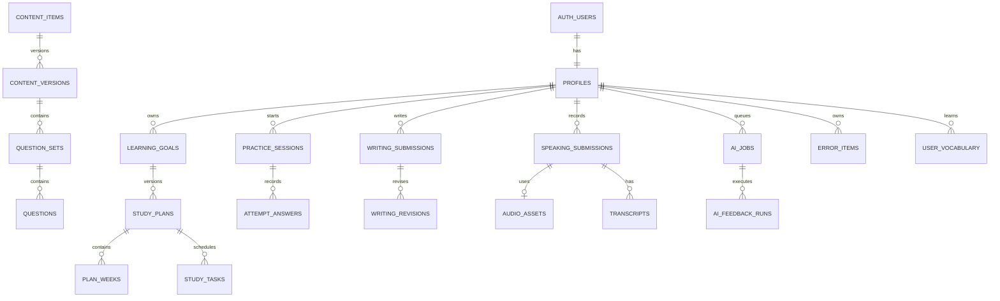

# DATABASE SCHEMA - Web tự học IELTS

> Phiên bản: 1.0  
> Database: PostgreSQL/Supabase  
> Quy ước: `snake_case`, UUID, `timestamptz`, UTC khi lưu và timezone khi hiển thị

## 1. Nguyên tắc

- `auth.users` là nguồn identity; `public.profiles.id = auth.users.id`.
- Bảng user-owned có `user_id` rõ để RLS và query ownership đơn giản.
- Không hard-delete dữ liệu ảnh hưởng kết quả học tập nếu chưa qua retention/delete workflow.
- Content đã publish, submission đã submit và feedback run là snapshot bất biến.
- State transition không update tùy ý từ client.
- Idempotency key dùng cho mutation có nguy cơ retry/double-click.
- `created_at`, `updated_at` dùng `timestamptz`; trigger quản lý `updated_at`.
- Dữ liệu analytics aggregate có thể rebuild; không dùng làm nguồn sự thật nghiệp vụ.

## 2. Extensions và kiểu dùng chung

Khuyến nghị extensions: `pgcrypto`, `citext`; chỉ bật `pg_trgm` khi search cần thiết.

### 2.1. Enums hoặc CHECK constraints

| Type                | Values                                                                          |
| ------------------- | ------------------------------------------------------------------------------- |
| `app_role`          | `LEARNER`, `CONTENT_EDITOR`, `SUPPORT`, `ADMIN`, `SUPER_ADMIN`                  |
| `test_type`         | `ACADEMIC`, `GENERAL_TRAINING`                                                  |
| `skill_type`        | `LISTENING`, `READING`, `WRITING`, `SPEAKING`, `VOCABULARY`, `GRAMMAR`          |
| `goal_status`       | `ACTIVE`, `COMPLETED`, `ARCHIVED`                                               |
| `plan_status`       | `DRAFT`, `ACTIVE`, `SUPERSEDED`, `COMPLETED`                                    |
| `task_status`       | `NOT_STARTED`, `IN_PROGRESS`, `SUBMITTED`, `REVIEWED`, `SKIPPED`, `RESCHEDULED` |
| `content_status`    | `DRAFT`, `IN_REVIEW`, `PUBLISHED`, `ARCHIVED`                                   |
| `practice_status`   | `DRAFT`, `ACTIVE`, `SUBMITTED`, `SCORED`, `REVIEWED`, `ABANDONED`               |
| `submission_status` | `DRAFT`, `SUBMITTED`, `PROCESSING`, `FEEDBACK_READY`, `FAILED`, `DELETED`       |
| `job_status`        | `QUEUED`, `PROCESSING`, `COMPLETED`, `FAILED`, `RETRYING`, `DEAD`, `CANCELLED`  |
| `error_status`      | `OPEN`, `REVIEWING`, `MASTERED`, `ARCHIVED`                                     |
| `confidence_level`  | `LOW`, `MEDIUM`, `HIGH`                                                         |

PostgreSQL enum phù hợp cho state ổn định; taxonomy mở như question type/topic nên dùng lookup/tag table hoặc validated text.

## 3. Sơ đồ domain cấp cao



## 4. Identity, settings và consent

### 4.1. `profiles`

| Column                     | Type         | Rules                                     |
| -------------------------- | ------------ | ----------------------------------------- |
| `id`                       | uuid PK      | FK `auth.users(id)` ON DELETE CASCADE     |
| `display_name`             | text         | 1-100 chars                               |
| `timezone`                 | text         | IANA timezone, default `Asia/Ho_Chi_Minh` |
| `locale`                   | text         | default `vi-VN`                           |
| `current_band`             | numeric(2,1) | nullable, 0-9 step 0.5                    |
| `target_band`              | numeric(2,1) | nullable, 0-9 step 0.5                    |
| `exam_date`                | date         | nullable                                  |
| `onboarding_completed_at`  | timestamptz  | nullable                                  |
| `created_at`, `updated_at` | timestamptz  | required                                  |

### 4.2. `user_roles`

`user_id uuid`, `role app_role`, `granted_by uuid`, `granted_at timestamptz`, unique `(user_id, role)`.

Role mutation chỉ qua protected server function/use case; learner không tự ghi.

### 4.3. `user_settings`

`user_id PK`, `study_reminder_enabled`, `email_enabled`, `daily_reminder_time`, `week_starts_on`, `reduced_motion`, timestamps.

### 4.4. `consents`

| Column                      | Type                                                           |
| --------------------------- | -------------------------------------------------------------- |
| `id`                        | uuid PK                                                        |
| `user_id`                   | uuid FK                                                        |
| `consent_type`              | text (`TERMS`, `PRIVACY`, `AI_PROCESSING`, `AUDIO_PROCESSING`) |
| `version`                   | text                                                           |
| `granted`                   | boolean                                                        |
| `recorded_at`, `revoked_at` | timestamptz                                                    |
| `metadata`                  | jsonb, không lưu fingerprint quá mức cần thiết                 |

Unique `(user_id, consent_type, version)`.

## 5. Goals và planning

### 5.1. `learning_goals`

| Column                              | Type         | Rules                     |
| ----------------------------------- | ------------ | ------------------------- |
| `id`                                | uuid PK      |                           |
| `user_id`                           | uuid FK      | owner                     |
| `test_type`                         | enum         | default `ACADEMIC`        |
| `current_overall`, `target_overall` | numeric(2,1) | 0-9 step 0.5              |
| `target_by_skill`                   | jsonb        | optional, keys theo skill |
| `exam_date`                         | date         | nullable                  |
| `minutes_per_day`                   | smallint     | 5-240                     |
| `study_days`                        | smallint[]   | ISO 1-7, unique           |
| `weak_skills`                       | skill_type[] | tối đa 4                  |
| `status`                            | goal_status  |                           |
| `created_at`, `updated_at`          | timestamptz  |                           |

Partial unique index: một `ACTIVE` goal/user.

### 5.2. `diagnostic_sessions`

`id`, `user_id`, `goal_id`, `status`, `started_at`, `submitted_at`, `scores jsonb`, `evidence jsonb`, `confidence_by_skill jsonb`, `content_version_id`.

### 5.3. `study_plans`

| Column                   | Type         | Rules                           |
| ------------------------ | ------------ | ------------------------------- |
| `id`                     | uuid PK      |                                 |
| `user_id`, `goal_id`     | uuid FK      | denormalize owner để RLS/index  |
| `version`                | integer      | >= 1                            |
| `start_date`, `end_date` | date         | end >= start                    |
| `status`                 | plan_status  |                                 |
| `rationale`              | jsonb        | inputs, rules và lý do thay đổi |
| `generator_version`      | text         | required                        |
| `supersedes_plan_id`     | uuid FK self | nullable                        |
| timestamps               | timestamptz  |                                 |

Unique `(user_id, goal_id, version)`; partial unique một `ACTIVE` plan/user/goal.

### 5.4. `plan_weeks`

`id`, `plan_id`, `week_number`, `starts_on`, `ends_on`, `focus_skills skill_type[]`, `maintenance_skill`, `target_minutes`, `rationale jsonb`.

Unique `(plan_id, week_number)`; tối đa 2 focus skills được validate ở service/DB function.

### 5.5. `study_tasks`

| Column                                      | Type         | Rules                                |
| ------------------------------------------- | ------------ | ------------------------------------ |
| `id`                                        | uuid PK      |                                      |
| `user_id`, `plan_id`, `plan_week_id`        | uuid FK      | owner denormalized                   |
| `scheduled_date`                            | date         | theo learner timezone                |
| `task_type`                                 | text         | validated taxonomy                   |
| `skill`                                     | skill_type   |                                      |
| `source_type`, `source_id`                  | text, uuid   | typed reference validated by service |
| `estimated_minutes`                         | smallint     | 1-240                                |
| `priority`                                  | smallint     | 1-5                                  |
| `status`                                    | task_status  |                                      |
| `started_at`, `submitted_at`, `reviewed_at` | timestamptz  | nullable                             |
| `rescheduled_from_id`                       | uuid FK self | nullable                             |
| timestamps                                  | timestamptz  |                                      |

Indexes: `(user_id, scheduled_date, status)`, `(plan_id, scheduled_date)`. Duplicate guard theo `(plan_id, scheduled_date, task_type, source_type, source_id)` khi source không null.

### 5.6. `task_events`

Append-only: `id`, `user_id`, `task_id`, `event_type`, `from_status`, `to_status`, `occurred_at`, `metadata jsonb`, `idempotency_key`.

## 6. Content và question bank

### 6.1. `content_items`

Logical identity: `id`, `kind`, `slug`, `current_published_version_id`, `created_by`, timestamps. Unique lower-case slug.

### 6.2. `content_versions`

| Column                                       | Type            |
| -------------------------------------------- | --------------- |
| `id`                                         | uuid PK         |
| `content_item_id`                            | uuid FK         |
| `version`                                    | integer         |
| `status`                                     | content_status  |
| `title`, `summary`, `body_json`              | text/text/jsonb |
| `skill`, `difficulty`, `topic`               | enum/text/text  |
| `estimated_minutes`                          | smallint        |
| `source_name`, `source_url`, `licence`       | text            |
| `created_by`, `approved_by`                  | uuid            |
| `approved_at`, `published_at`, `archived_at` | timestamptz     |
| `checksum`                                   | text            |

Unique `(content_item_id, version)`. Published rows không update nội dung; DB trigger có thể enforce.

### 6.3. Tags

- `tags(id, group_name, code, label, active)` unique `(group_name, code)`.
- `content_version_tags(content_version_id, tag_id)` PK đôi.

### 6.4. `question_sets`

`id`, `content_version_id`, `skill`, `title`, `instructions`, `time_limit_sec`, `settings jsonb`, `version_checksum`.

### 6.5. `questions`

`id`, `question_set_id`, `position`, `question_type`, `prompt_json`, `points numeric`, `difficulty`, `metadata jsonb`.

Unique `(question_set_id, position)`.

### 6.6. `question_options`, `answer_keys`, `explanations`

- Options: `id`, `question_id`, `position`, `value`, `label`, unique `(question_id, position)`.
- Answer keys: `question_id PK`, `answer_json`, `scoring_rule`, `case_sensitive`, `normalization_rules`.
- Explanations: `question_id PK`, `explanation_json`, `source_refs jsonb`.

Answer keys chỉ được expose qua trusted server path sau submit.

### 6.7. Writing/Speaking prompts

`writing_prompts` và `speaking_prompts` tham chiếu `content_version_id`, có `task_type/part`, `prompt_text`, `asset_id`, `constraints jsonb`, `rubric_version_id`.

## 7. Practice

### 7.1. `practice_sessions`

| Column                                                   | Type                                             |
| -------------------------------------------------------- | ------------------------------------------------ |
| `id`                                                     | uuid PK                                          |
| `user_id`                                                | uuid FK                                          |
| `study_task_id`                                          | uuid nullable                                    |
| `question_set_id`, `content_version_id`                  | uuid FK snapshot                                 |
| `mode`                                                   | text (`PRACTICE`, `TIMED`, `DIAGNOSTIC`, `MOCK`) |
| `status`                                                 | practice_status                                  |
| `started_at`, `submitted_at`, `scored_at`, `reviewed_at` | timestamptz                                      |
| `duration_sec`, `score`, `max_score`                     | integer/numeric                                  |
| `idempotency_key`                                        | text                                             |
| `client_revision`                                        | integer                                          |
| timestamps                                               | timestamptz                                      |

Unique `(user_id, idempotency_key)` khi key không null.

### 7.2. `attempt_answers`

`id`, `practice_session_id`, `question_id`, `answer_json`, `is_correct`, `score`, `time_spent_sec`, `client_revision`, `saved_at`, `finalized_at`.

Unique `(practice_session_id, question_id)`. Sau session `SUBMITTED`, answer không update.

### 7.3. `annotations`

`id`, `user_id`, `practice_session_id`, `content_version_id`, `anchor_json`, `note_text`, timestamps. Anchor phải refer snapshot version.

## 8. Vocabulary và SRS

### 8.1. `vocabulary_items`

Shared canonical lexeme: `id`, `term`, `normalized_term`, `language`, `meaning_json`, `ipa`, `audio_asset_id`, `examples jsonb`.

Unique `(language, normalized_term)` chỉ cho canonical item; personal meaning nằm ở user table.

### 8.2. `user_vocabulary`

`id`, `user_id`, `vocabulary_item_id`, `context_type`, `context_id`, `personal_note`, `status`, `ease_factor`, `interval_days`, `repetitions`, `next_review_at`, timestamps.

Unique `(user_id, vocabulary_item_id, context_type, context_id)` với quy ước null context rõ.

### 8.3. `vocab_reviews`

Append-only: `id`, `user_vocabulary_id`, `user_id`, `rating` (0-5), `reviewed_at`, `previous_state jsonb`, `next_state jsonb`, `response_ms`.

## 9. Writing

### 9.1. `writing_drafts`

`id`, `user_id`, `prompt_id`, `study_task_id`, `text`, `word_count`, `client_revision`, `server_revision`, `last_saved_at`, timestamps.

Unique active draft theo `(user_id, prompt_id, study_task_id)` nếu phù hợp.

### 9.2. `writing_submissions`

`id`, `user_id`, `prompt_id`, `study_task_id`, `draft_id`, `text`, `word_count`, `status`, `submitted_at`, `idempotency_key`, `content_checksum`.

Unique `(user_id, idempotency_key)`. `text` immutable sau insert.

### 9.3. `writing_revisions`

`id`, `user_id`, `submission_id`, `parent_revision_id`, `revision_number`, `text`, `word_count`, `submitted_at`, `change_summary jsonb`.

Unique `(submission_id, revision_number)`; immutable.

## 10. Speaking và media

### 10.1. `upload_intents`

`id`, `user_id`, `purpose`, `expected_mime`, `max_bytes`, `max_duration_sec`, `storage_path`, `expires_at`, `status`, `checksum`, timestamps.

Storage path bắt đầu bằng owner ID; finalize một lần.

### 10.2. `audio_assets`

`id`, `user_id`, `storage_bucket`, `storage_path`, `mime_type`, `size_bytes`, `duration_sec`, `checksum`, `status`, `retention_until`, `deleted_at`, timestamps.

Unique `(storage_bucket, storage_path)`; không trả path trực tiếp cho browser.

### 10.3. `speaking_submissions`

`id`, `user_id`, `prompt_id`, `study_task_id`, `audio_asset_id`, `duration_sec`, `status`, `consent_version`, `submitted_at`, `idempotency_key`.

### 10.4. `transcripts`

`id`, `user_id`, `speaking_submission_id`, `kind` (`ORIGINAL`, `USER_EDITED`), `text`, `segments jsonb`, `language`, `quality`, `source_transcript_id`, timestamps.

Original immutable; edited transcript là row mới.

## 11. AI và jobs

### 11.1. `prompt_versions`, `rubric_versions`

- Prompt: `id`, `feature`, `version`, `template`, `schema_json`, `status`, `created_by`, timestamps.
- Rubric: `id`, `skill`, `version`, `descriptor_json`, `licence/source metadata`, status.

Unique `(feature, version)` và `(skill, version)`.

### 11.2. `ai_jobs`

| Column                                           | Type           |
| ------------------------------------------------ | -------------- |
| `id`                                             | uuid PK        |
| `user_id`                                        | uuid FK        |
| `job_type`, `entity_type`, `entity_id`           | text/text/uuid |
| `status`                                         | job_status     |
| `idempotency_key`                                | text           |
| `attempt_count`, `max_attempts`                  | smallint       |
| `available_at`, `locked_at`, `lease_expires_at`  | timestamptz    |
| `locked_by`                                      | text           |
| `last_error_code`, `last_error_message_redacted` | text           |
| `created_at`, `updated_at`, `completed_at`       | timestamptz    |

Unique `(user_id, job_type, entity_id, idempotency_key)`. Index `(status, available_at)` và lease recovery.

### 11.3. `ai_feedback_runs`

`id`, `job_id`, `user_id`, `entity_type`, `entity_id`, `model`, `prompt_version_id`, `rubric_version_id`, `input_checksum`, `output_json`, `raw_response_ref`, `validation_status`, `confidence`, `input_tokens`, `output_tokens`, `estimated_cost`, `latency_ms`, `created_at`.

Output chỉ được cấp cho UI khi `validation_status = VALID`.

## 12. Error notebook và analytics

### 12.1. `error_items`

`id`, `user_id`, `skill`, `error_type`, `source_type`, `source_id`, `source_anchor jsonb`, `evidence`, `correction`, `explanation`, `status`, `occurrence_count`, `first_seen_at`, `last_seen_at`, `next_review_at`.

Index `(user_id, status, next_review_at)`; duplicate key nghiệp vụ gồm owner + source + anchor + error type.

### 12.2. `error_reviews`

Append-only: `id`, `user_id`, `error_item_id`, `result`, `confidence`, `reviewed_at`, `next_review_at`.

### 12.3. `events`

Append-only, có retention: `id`, `user_id`, `event_name`, `occurred_at`, `local_date`, `entity_type`, `entity_id`, `properties jsonb`, `schema_version`.

Không đưa raw writing/transcript vào analytics properties.

### 12.4. `daily_learning_stats`, `skill_mastery`

- Daily: unique `(user_id, local_date)`; minutes, task counts, effective sessions, reviews.
- Mastery: unique `(user_id, skill, taxonomy_key)`; score 0-1, inputs summary, algorithm version, calculated_at.

## 13. Admin, feature flags và audit

### 13.1. `feature_flags`

`id`, `key`, `description`, `environment`, `enabled`, `rollout_percentage`, `cohort_rule jsonb`, `updated_by`, timestamps. Unique `(key, environment)`.

### 13.2. `admin_audit_logs`

Append-only: `id`, `actor_id`, `permission`, `action`, `entity_type`, `entity_id`, `before_summary jsonb`, `after_summary jsonb`, `trace_id`, `created_at`.

Không lưu secret hoặc full sensitive content trong before/after.

### 13.3. `idempotency_records`

`id`, `user_id`, `operation`, `key`, `request_hash`, `resource_type`, `resource_id`, `response_code`, `response_json`, `expires_at`, timestamps. Unique `(user_id, operation, key)`.

## 14. State machines

### 14.1. Study task

```text
NOT_STARTED -> IN_PROGRESS -> SUBMITTED -> REVIEWED
NOT_STARTED/IN_PROGRESS -> SKIPPED
NOT_STARTED/IN_PROGRESS -> RESCHEDULED -> new task NOT_STARTED
```

Không `REVIEWED` khi chưa có review/feedback evidence.

### 14.2. Practice session

```text
DRAFT -> ACTIVE -> SUBMITTED -> SCORED -> REVIEWED
DRAFT/ACTIVE -> ABANDONED
```

### 14.3. AI job

```text
QUEUED -> PROCESSING -> COMPLETED
PROCESSING -> FAILED -> RETRYING -> PROCESSING
FAILED/RETRYING -> DEAD
QUEUED/RETRYING -> CANCELLED
```

### 14.4. Content và plan

```text
Content: DRAFT -> IN_REVIEW -> PUBLISHED -> ARCHIVED
Plan: DRAFT -> ACTIVE -> SUPERSEDED
Plan: DRAFT/ACTIVE -> COMPLETED
```

## 15. RLS baseline

### 15.1. User-owned tables

- `SELECT/INSERT/UPDATE`: `user_id = auth.uid()` và transition/field restrictions qua server.
- Không cho learner `DELETE` trực tiếp submission, audio metadata hoặc audit/event; dùng delete workflow.
- Child table policy dựa trên denormalized `user_id` hoặc `EXISTS` parent ownership có index.

### 15.2. Content

- Learner đọc `PUBLISHED` version.
- Content editor đọc draft theo permission; insert/update draft.
- Publish/archive chỉ qua server use case có permission và audit.

### 15.3. Admin/ops

- Role/permission lấy từ trusted table/claim được server xác minh.
- Không mở broad `USING (is_admin())` cho mọi bảng.
- Service role worker vẫn scope entity theo job owner và business invariant.

Tất cả policy phải có integration tests user A/user B và role matrix.

## 16. Index checklist

- Mọi FK dùng cho join/delete có index.
- `study_tasks(user_id, scheduled_date, status)`.
- `practice_sessions(user_id, status, started_at desc)`.
- `writing_submissions(user_id, submitted_at desc)`.
- `ai_jobs(status, available_at)` và `(user_id, entity_type, entity_id)`.
- `error_items(user_id, status, next_review_at)`.
- `events(user_id, occurred_at)`; cân nhắc partition/retention sau khi có tải.
- `content_versions(content_item_id, status, version desc)`.
- GIN chỉ cho JSONB có query thực tế; không tạo mặc định.

## 17. Migration và seed

- Migration forward-only trong CI; production có forward-fix/rollback plan rõ.
- Seed dev/test: 2 learner để test cross-user, 1 editor, 1 admin; goal/plan/task; published lesson; Reading set; Listening set; Writing prompt; Speaking prompt.
- Không seed production credential hoặc nội dung không rõ licence.
- Migration thay state/schema phải tương thích ít nhất một deploy window giữa app cũ/mới.

## 18. Retention và deletion

- Audio có `retention_until`; cleanup job xóa object rồi tombstone metadata.
- User delete/export workflow xác định rõ dữ liệu phải xóa, anonymize hoặc giữ vì audit/legal.
- AI raw response và application logs có TTL ngắn hơn validated feedback khi có thể.
- Analytics event hết retention được aggregate/anonymize trước khi xóa.

Các thời hạn cụ thể đang là quyết định mở trong [KNOWN_ISSUES.md](./KNOWN_ISSUES.md).
