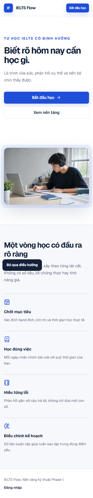
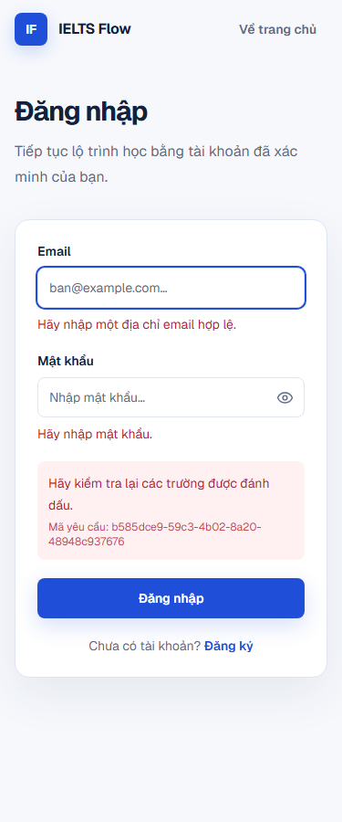
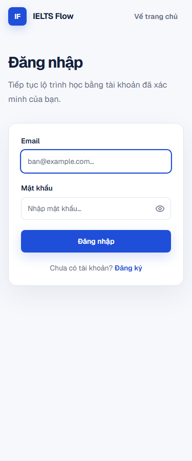
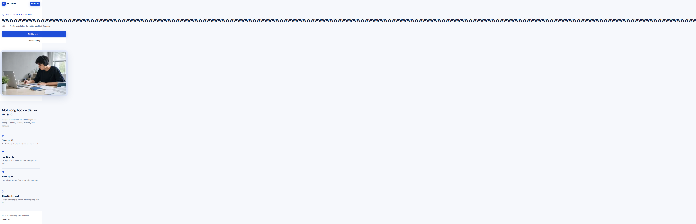
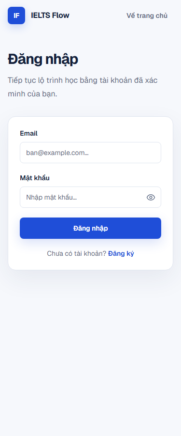

# UX_ACCESSIBILITY_AUDIT_REPORT

**Ngày audit:** 2026-07-16  
**Phạm vi:** Public, Auth, Onboarding, Dashboard, Learn, Practice, Result, Profile, Progress, planned Roadmap và trạng thái AI/Audio/Timer  
**Viewports:** 375, 768, 1024, 1440 px  
**Chuẩn tham chiếu:** WCAG 2.2 A/AA, Vercel Web Interface Guidelines, keyboard-only và mobile usability  
**Kết luận:** `NEEDS REMEDIATION` — không có lỗi Critical; có **2 High, 12 Medium, 3 Low**.

Audit này chỉ đánh giá và lập kế hoạch sửa. Không redesign hoặc thay đổi application UI.

## 1. Phương pháp và bằng chứng

- Production build được phục vụ cục bộ và kiểm tra bằng Chromium headless.
- Playwright Python chạy 12 tổ hợp public/auth route × viewport, keyboard order, first-error focus, long-token, reduced motion, offline và protected-route guard.
- Axe Core 4.12.1 chạy theo WCAG 2 A/AA, 2.1 AA và 2.2 AA.
- Source audit bao phủ App Router pages, layouts, shared states, forms, learning reader, practice runner/result và navigation shell.
- Token màu được tính contrast theo relative luminance.
- Rule set: [Vercel Web Interface Guidelines](https://raw.githubusercontent.com/vercel-labs/web-interface-guidelines/main/command.md) và [WCAG 2.2](https://www.w3.org/TR/WCAG22/).

### Giới hạn bằng chứng

Shell audit không có dedicated authenticated credential. Vì vậy:

- Browser xác minh đầy đủ public/auth và toàn bộ protected-route redirect boundary.
- Onboarding/learn/practice/result/profile/progress được audit bằng source, component tests và bằng chứng authenticated two-user E2E đã có từ Phase 5.
- Không claim có screenshot fresh của nội dung protected sau login.
- AI Writing/Speaking, audio recorder và timer chưa được triển khai; không tạo mock hoặc fake route để che coverage gap.

Raw browser evidence: [browser-audit.json](./ux-accessibility-evidence/browser-audit.json). Script tái chạy: [`scripts/ux_accessibility_audit.py`](../scripts/ux_accessibility_audit.py).

## 2. Executive summary

### Điểm tốt

- Public/auth không horizontal overflow ở 375/768/1024/1440 với nội dung hiện tại.
- Axe không phát hiện violation trên initial public/auth pages ở cả 12 tổ hợp.
- Public/auth có đúng một `h1`, heading order hợp lý, `main` landmark và page title rõ.
- Không có control public/auth thiếu label hoặc interactive element thiếu accessible name.
- Login/register focus đúng field lỗi đầu tiên; field errors gắn qua `aria-describedby`.
- Focus ring 2 px hiện rõ trên input/link; keyboard order hợp logic.
- Main buttons, icon buttons và question navigation chủ yếu đạt 44 px.
- Base palette đạt tối thiểu 5.05:1 cho text thường trong các pairing đang dùng.
- Reduced motion chuyển `scroll-behavior` về `auto` và rút transition còn `0.01ms`.
- Empty/error states có copy thật; không dùng fake score, fake progress hoặc fake AI feedback.
- Question navigation có `aria-label`, `aria-current="step"` và saved state trong accessible name.

### Rủi ro chính

1. Mobile drawer không quản lý focus như modal.
2. Long unbroken title phá reflow và bị `overflow-x: hidden` che mất.
3. Request ID trong error state chỉ đạt 4.21:1 do `opacity-80`.
4. Practice save/start thiếu pending/disabled state và chưa cảnh báo answer chưa lưu.
5. Correct/incorrect result chưa có text programmatic cho screen reader.
6. Session expiry và offline chưa có recovery state đáng tin cậy.

## 3. Route coverage

| Surface | Browser matrix | Keyboard/source audit | Kết quả chính |
| --- | --- | --- | --- |
| `/` | 375/768/1024/1440 | PASS | Responsive tốt; long-token và CTA copy cần sửa |
| `/login`, `/register` | 375/768/1024/1440 | PASS có finding | Labels/focus/error tốt; thiếu skip link, error metadata contrast fail |
| `/onboarding` | Route guard + source | Có finding | Wizard semantics tốt; card focus và unsaved-change cần sửa |
| `/dashboard` | Route guard + source | Có finding | Landmark/heading tốt; dynamic long name cần wrap |
| `/learn/**` | Route guard + source + Phase 5 E2E | Có finding | Reader/navigation tốt; long content và current nav cần sửa |
| `/practice/**` | Route guard + source + Phase 5 E2E | Có finding | 44 px question nav, labels tốt; pending, unsaved, color cue và error token cần sửa |
| `/practice/**/result/**` | Route guard + source + Phase 5 E2E | Có finding | Non-color visual icon tốt; screen-reader correctness text còn thiếu |
| `/profile` | Route guard + source | Có finding | Form labels/errors tốt; request-ID contrast và long content |
| `/progress` | Route guard + source | PASS có shared findings | Semantic lists/metrics tốt; active nav parent route chưa nhất quán |
| Roadmap/planned features | Route guard + source | Có finding | Không fake data, nhưng primary-nav status còn mơ hồ |
| AI/audio/recording/timer | Không có route/control | N/A | Chưa triển khai; phải audit riêng trước khi bật |

## 4. Findings theo severity

### UXA-001 — High — Mobile navigation dialog không trap/restore focus

**WCAG impact:** 2.4.3 Focus Order, 2.4.11 Focus Not Obscured; rủi ro 2.1.2 No Keyboard Trap theo hướng ngược lại vì focus thoát khỏi modal.

- `src/components/layout/app-shell.tsx:69` — chỉ quản lý `mobileOpen`.
- `src/components/layout/app-shell.tsx:71` — effect chỉ bắt Escape và khóa body scroll.
- `src/components/layout/app-shell.tsx:144` — dialog được render nhưng không focus phần tử đầu.
- `src/components/layout/app-shell.tsx:152` — không trap focus, không `inert` background, không trả focus về nút mở.

**Ảnh hưởng:** keyboard/screen-reader user có thể Tab vào nội dung phía sau overlay, mất vị trí sau khi đóng hoặc không biết modal vừa mở.

**Fix:** lưu ref nút trigger; focus nút Close khi mở; trap Tab/Shift+Tab; đặt background inert; restore focus khi đóng; giữ Escape và body scroll lock.

### UXA-002 — High — Long token phá reflow và bị che bởi global overflow

**WCAG impact:** 1.4.10 Reflow, 1.4.4 Resize Text.

- `src/app/globals.css:45` — `overflow-x: hidden` che overflow thay vì xử lý nguồn.
- `src/components/shared/page-header.tsx:13` — dynamic heading chỉ dùng `text-pretty`, không `break-words`/`overflow-wrap:anywhere`.
- `src/components/learning/lesson-markdown.tsx:29` — paragraph Markdown không xử lý URL/token dài.
- `src/components/practice/practice-result.tsx:83` — learner answer/correct answer có thể chứa token dài.

Browser injection 180 ký tự liền cho thấy heading `clientWidth=576`, `scrollWidth=6189`, `overflowWrap=normal`.

**Fix:** thêm `min-w-0` đúng container và `break-words`/`[overflow-wrap:anywhere]` cho dynamic heading, breadcrumb, answer, Markdown link/text; bỏ global masking sau khi từng nguồn overflow đã được sửa.

### UXA-003 — Medium — Error request ID contrast 4.21:1

**WCAG impact:** 1.4.3 Contrast (Minimum). Axe impact: `serious`.

- `src/components/auth/login-form.tsx:89`
- `src/components/auth/register-form.tsx:143`
- `src/components/onboarding/onboarding-wizard.tsx:670`
- `src/components/profile/profile-form.tsx:77`
- `src/components/profile/learning-preferences-form.tsx:324`

`opacity-80` pha `--destructive` với `--destructive-subtle`, tạo màu thực tế `#c34c5c`, chỉ đạt 4.21:1 cho text 12 px.

**Fix:** bỏ opacity; dùng trực tiếp `text-[var(--destructive)]` hoặc token metadata tối hơn, sau đó rerun axe ở error state.

### UXA-004 — Medium — Auth layout thiếu bypass link

**WCAG impact:** 2.4.1 Bypass Blocks.

- `src/app/(auth)/layout.tsx:11` — header lặp lại trên login/register.
- `src/app/(auth)/layout.tsx:21` — `main` không có `id="main-content"` và không có skip link.

**Fix:** dùng cùng skip-link pattern với public/dashboard/onboarding và gắn `id="main-content"`.

### UXA-005 — Medium — Correct/incorrect không có programmatic text

**WCAG impact:** 1.3.1 Info and Relationships, 4.1.2 Name/Role/Value.

- `src/components/practice/practice-result.tsx:59` — check/x icon truyền trạng thái nhưng đều `aria-hidden`.
- `src/components/practice/practice-result.tsx:73` — text chỉ đọc awarded/max points, không nói rõ “Đúng” hoặc “Sai”.

**Fix:** thêm visible hoặc `sr-only` text “Đúng”/“Sai” cạnh dòng câu; giữ icon shape để non-color visual cue.

### UXA-006 — Medium — Current question dựa vào màu cho người nhìn

**WCAG impact:** 1.4.1 Use of Color.

- `src/components/practice/practice-runner.tsx:72` — `aria-current="step"` tốt cho AT.
- `src/components/practice/practice-runner.tsx:76` — visual current state chỉ đổi border/background/text color.

**Fix:** thêm non-color cue như inset ring dày + marker/dot hoặc visible text “Hiện tại”; không bỏ `aria-current`.

### UXA-007 — Medium — Practice start/save thiếu pending và disabled state

**WCAG impact:** 3.2.2 On Input, 4.1.3 Status Messages; UX integrity.

- `src/components/practice/practice-runner.tsx:93` — save form không có client pending component.
- `src/components/practice/practice-runner.tsx:165` — Save button luôn enabled, không có “Đang lưu…”.
- `src/components/practice/practice-runner.tsx:210` — start form cũng không có pending/disabled state.
- `src/components/practice/submit-attempt-form.tsx:47` — submit cuối đã có pattern đúng để tái dùng.

**Fix:** tách Start/Save submit buttons dùng `useFormStatus`, disabled trong request, label “Đang bắt đầu…”/“Đang lưu…” và live status không trùng.

### UXA-008 — Medium — Chưa cảnh báo dữ liệu form chưa lưu

**WCAG impact:** 3.3.4 Error Prevention không bắt buộc cho loại dữ liệu này, nhưng là UX/data-loss risk.

- `src/components/practice/practice-runner.tsx:66` — question links có thể rời câu đang nhập trước khi Save.
- `src/components/practice/practice-runner.tsx:119` — short text có thể mất khi refresh/navigation.
- `src/components/onboarding/onboarding-wizard.tsx:121` — Back đổi step và bỏ thay đổi chưa submit.
- `src/components/onboarding/onboarding-wizard.tsx:220` — `moveTo` không kiểm tra dirty state.

**Fix:** track dirty state; autosave hợp lệ hoặc confirm khi rời câu/step; thêm `beforeunload` chỉ khi dirty; không cảnh báo sau khi save thành công.

### UXA-009 — Medium — Loading live region không có announcement text

**WCAG impact:** 4.1.3 Status Messages.

- `src/components/shared/loading-state.tsx:5` — container có `aria-label` và `aria-live` nhưng không có text node.
- `src/components/ui/skeleton.tsx:11` — skeleton đúng là `aria-hidden`, khiến live region thực tế rỗng.

**Fix:** dùng `role="status"` với `Đang tải nội dung…`; tránh chỉ đặt accessible name trên live container rỗng.

### UXA-010 — Medium — Proxy redirect session expired không truyền recovery message

**WCAG impact:** 3.3.1 Error Identification, 2.2.5 Re-authenticating; UX continuity.

- `src/lib/supabase/proxy.ts:46` — mọi unauthenticated/expired request cùng redirect.
- `src/lib/supabase/proxy.ts:49` — search params bị xóa và chỉ giữ `next`.
- `src/server/auth/account.ts:65` — server guard có `authError=session_expired`, nhưng thường bị proxy chặn trước.
- `src/features/auth/errors.ts:34` — copy session-expired đã có nhưng không luôn tới được UI.

**Fix:** phân biệt missing session với malformed/expired claim an toàn; khi có expired cookie, thêm allowlisted `authError=session_expired`; giữ safe `next`.

### UXA-011 — Medium — Offline reload cho màn trắng

**WCAG impact:** không phải violation WCAG độc lập; ảnh hưởng error recovery và perceived reliability.

Browser offline reload trả `ERR_INTERNET_DISCONNECTED`, title/body rỗng và screenshot trắng.

**Fix:** thêm offline detection/banner cho hydrated app; route-level retry state; cân nhắc minimal offline fallback/service worker sau khi product scope cho phép. Không giả vờ mutation đã lưu khi offline.

### UXA-012 — Medium — Parent navigation mất current state ở nested route

**WCAG impact:** 2.4.8 Location (AAA), navigation consistency UX.

- `src/components/layout/app-shell.tsx:37` — active chỉ khi `pathname === item.href`.

`/learn/vocabulary`, lesson detail và practice result không highlight parent “Thư viện học” hoặc contextual practice location.

**Fix:** match route boundary (`pathname === href || pathname.startsWith(href + "/")`); xác định practice thuộc Learn hoặc thêm explicit Practice nav/breadcrumb theo IA hiện tại.

### UXA-013 — Medium — Practice error dùng CSS token không tồn tại

**WCAG impact:** 1.4.1 Use of Color/non-color state consistency; visual regression.

- `src/components/practice/practice-runner.tsx:60` — `var(--danger-subtle)` không được khai báo.
- `src/app/globals.css:24` — design system dùng namespace `--destructive-*`.

**Fix:** đổi sang `--destructive-subtle` và thêm destructive text/border; giữ `role="alert"`.

### UXA-014 — Medium — Radio/checkbox card focus chỉ nằm trên control 16 px

**WCAG impact:** 2.4.7 Focus Visible, 2.4.11 Focus Not Obscured.

- `src/components/onboarding/onboarding-wizard.tsx:310` và `:544` — whole card clickable nhưng không có `focus-within` indicator.
- `src/components/practice/practice-runner.tsx:141` — answer card tương tự.

**Fix:** thêm `focus-within:ring-2 focus-within:ring-[var(--ring)]`; không xóa native input focus; đảm bảo checked state vẫn có non-color cue.

### UXA-015 — Low — Một số touch targets chỉ 36 px

**WCAG impact:** vẫn vượt WCAG 2.2 AA 2.5.8 minimum 24 px; chưa đạt best-practice 44 px/AAA 2.5.5 cho CTA quan trọng.

- `src/components/ui/button.tsx:23` — size `sm` là 36 px.
- `src/components/layout/marketing-header.tsx:19` — CTA mobile header dùng `sm`.
- `src/app/(auth)/layout.tsx:14` — “Về trang chủ” đo được 36 px cao.

**Fix:** dùng 44 px cho primary/mobile header actions; inline text links có thể giữ exception khi spacing đủ.

### UXA-016 — Low — Roadmap chưa làm nhưng đứng ngang hàng với feature hoàn chỉnh

**WCAG impact:** không trực tiếp; no-fake-CTA/product clarity.

- `src/components/layout/app-shell.tsx:25` — “Lộ trình” là primary navigation bình thường.
- `src/app/(dashboard)/roadmap/page.tsx:12` — page chỉ là empty foundation state.
- `src/components/shared/foundation-page.tsx:23` — badge nói “Nền tảng”, không nói “Sắp triển khai”.

**Fix:** đổi badge/status/copy thành “Sắp triển khai” hoặc hạ route khỏi primary nav cho tới khi có chức năng; vẫn cho xem explanatory page nếu product muốn.

### UXA-017 — Low — CTA/copy trạng thái sản phẩm chưa nhất quán

**WCAG impact:** 2.4.4 Link Purpose theo UX interpretation; trust/content quality.

- `src/app/page.tsx:71` — “Xem nền tảng” dẫn tới protected `/dashboard`, visitor bị đưa tới login thay vì preview.
- `src/app/page.tsx:138` — footer vẫn ghi “Nền tảng kỹ thuật Phase 1” dù Phase 5 đã complete.

**Fix:** đổi CTA thành “Đăng nhập để xem nền tảng” hoặc tạo preview thật; cập nhật footer theo trạng thái sản phẩm không dùng phase nội bộ.

## 5. Pass evidence

### Responsive và overflow hiện tại

| Route | 375 | 768 | 1024 | 1440 |
| --- | --- | --- | --- | --- |
| `/` | PASS | PASS | PASS | PASS |
| `/login` | PASS | PASS | PASS | PASS |
| `/register` | PASS | PASS | PASS | PASS |

`documentElement.scrollWidth <= clientWidth` ở cả 12 case với nội dung production hiện tại. Long-token synthetic là case fail riêng và không bị coi là PASS.

### Headings, landmarks và names

- `/`: `h1 → h2 → h3`, một `main`, một primary `nav`, footer semantic.
- `/login`, `/register`: một `h1`, một `main`, labels đầy đủ.
- Public/auth: 0 unnamed interactive elements, 0 unlabeled form controls, 0 duplicate IDs.
- Protected route guard giữ safe `next` và đưa anonymous user về login.

### Forms và keyboard

- Login empty-submit focus `#login-email`.
- Register empty-submit focus `#register-display-name`; 3 invalid fields được đánh dấu.
- Email/password/name có `name`, `type`, `autocomplete`, label và screen-reader name.
- Password visibility button có `aria-label` và `aria-pressed`.
- Auth pending buttons đổi copy và disabled sau khi request bắt đầu.

### Contrast token baseline

| Pair | Ratio |
| --- | ---: |
| foreground / surface | 16.00:1 |
| muted foreground / surface | 5.37:1 |
| primary / surface | 6.69:1 |
| white / primary | 6.69:1 |
| success / success-subtle | 5.88:1 |
| warning / warning-subtle | 5.54:1 |
| destructive / destructive-subtle | 5.87:1 |
| muted foreground / background | 5.05:1 |

Opacity/compositing vẫn phải đo riêng; UXA-003 là ví dụ baseline token pass nhưng rendered text fail.

### Reduced motion

- `prefers-reduced-motion: reduce` được nhận.
- `html` scroll behavior chuyển thành `auto`.
- Animation/transition duration bị rút xuống `0.01ms`.

## 6. Audio, recording, timer và AI

### Current status

- Không có route/component Audio player, microphone permission, recording, upload progress hoặc audio delete flow.
- Không có practice timer/countdown.
- Không có AI Writing/Speaking feedback route, job status hoặc quota UI.
- Dashboard nói rõ suggestion hiện tại không phải lộ trình hoặc AI.
- Không có disabled AI CTA giả hoặc score AI giả trong application hiện tại.

### Gate bắt buộc trước khi triển khai

1. Audio: native control accessible name, playback rate, transcript policy, keyboard operation và no-autoplay.
2. Recording: pre-permission explanation, denied/dismissed/browser-unsupported states, live region, elapsed/max timer, stop/delete confirmation.
3. Timer: pause/adjust accommodation, warning không chỉ dựa màu, tabular numerals, screen-reader announcements không spam.
4. AI: pending/timeout/retry/dead states, disclaimer, evidence/rubric version, no fake success, quota/status không chỉ dựa màu.
5. Re-audit ở 4 viewport, keyboard-only và real screen reader trước khi feature flag bật.

## 7. Fix plan

### P0 — trước accessibility sign-off

1. UXA-001 mobile dialog focus management.
2. UXA-002 long-content reflow.
3. UXA-003 rendered error contrast.
4. UXA-004 auth skip link.
5. UXA-005 result correctness accessible text.

### P1 — sprint kế tiếp

1. UXA-006 current-question non-color cue.
2. UXA-007 pending/disabled states cho Start/Save.
3. UXA-008 dirty-state/data-loss warning.
4. UXA-009 loading announcement.
5. UXA-010 session-expired recovery.
6. UXA-011 offline recovery.
7. UXA-012 nested active navigation.
8. UXA-013 practice error token.
9. UXA-014 card focus indicator.

### P2 — polish không cần redesign

1. UXA-015 tăng important touch targets lên 44 px.
2. UXA-016 làm rõ Roadmap planned status.
3. UXA-017 sửa CTA/footer copy.

## 8. Screenshot evidence

### Public mobile 375 px

### Login validation và first-error focus

### Long-title reflow failure

### Offline failure

### Protected route boundary

Các ảnh còn lại trong [ux-accessibility-evidence](./ux-accessibility-evidence/) bao gồm home/login/register ở 4 viewport và từng protected route guard.

## 9. Exit criteria sau khi sửa

- 0 Critical/High open.
- Axe 0 A/AA violations ở initial, validation, loading, error và result states.
- Mobile drawer trap/restore focus đúng; không focus background.
- Long-token không tăng document width ở 375/768/1024/1440.
- Authenticated screenshots fresh cho onboarding, learn, practice, result, profile và progress bằng dedicated test users.
- Keyboard-only hoàn thành được onboarding và exercise từ start đến result.
- Offline/session-expired states có copy, next step và không làm người dùng hiểu sai trạng thái lưu.
- Audio/timer/AI giữ N/A cho tới khi có implementation; khi triển khai phải qua gate mục 6.
